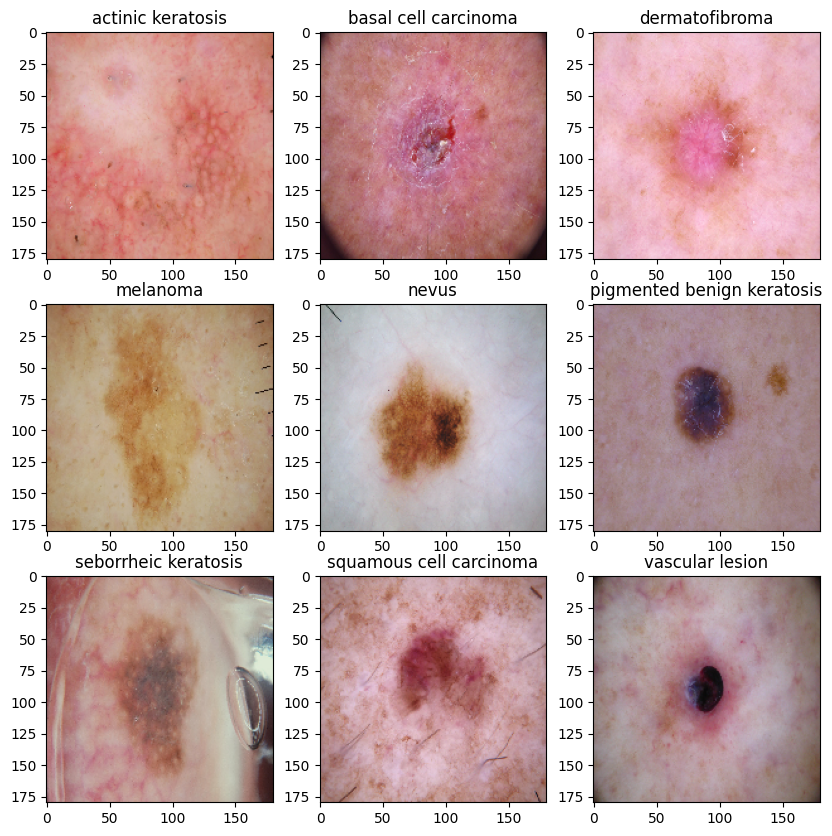
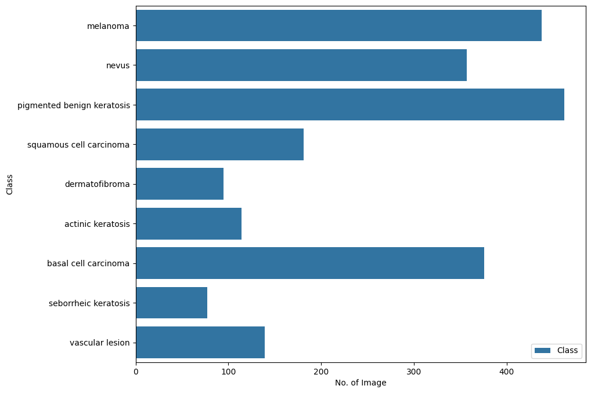
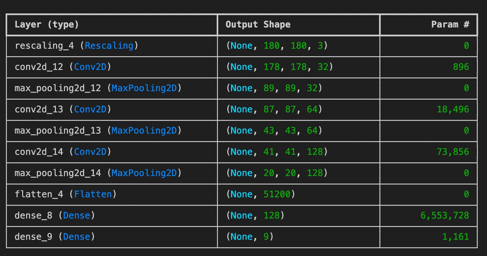
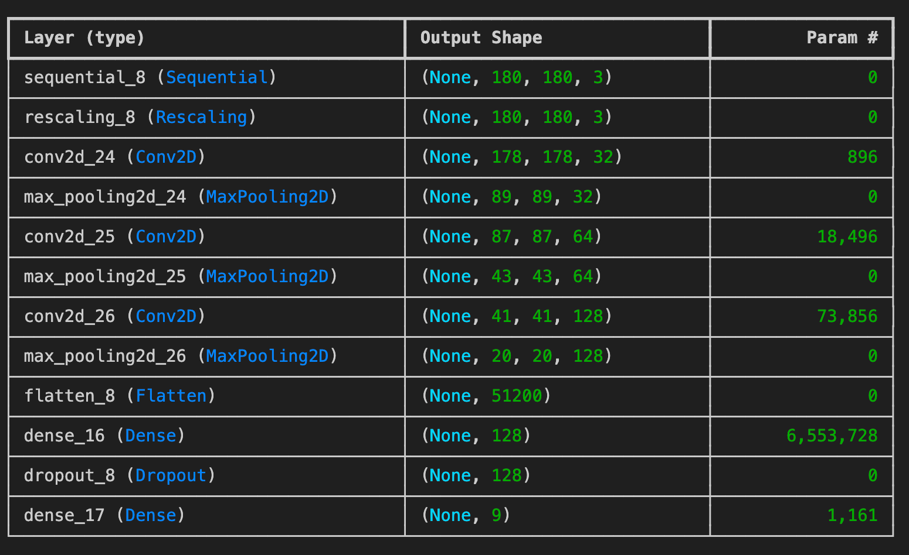
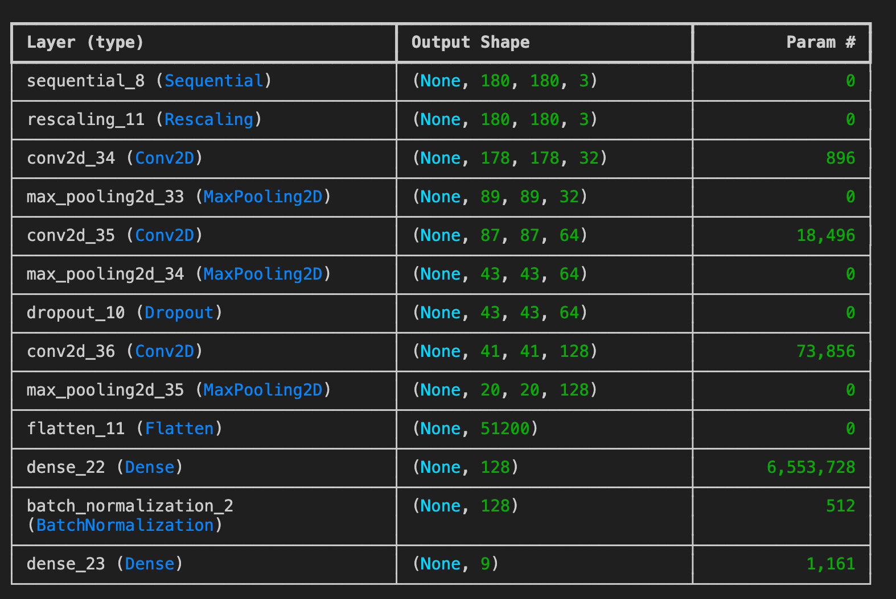

# Melanoma Skin Cancer Detection

## Problem Statement
**Problem statement**:

To build a CNN based model which can accurately detect melanoma. Melanoma is a type of cancer that can be deadly if not detected early. It accounts for 75% of skin cancer deaths. A solution that can evaluate images and alert dermatologists about the presence of melanoma has the potential to reduce a lot of manual effort needed in diagnosis.

The dataset consists of 2357 images of malignant and benign oncological diseases, which were formed from the International Skin Imaging Collaboration (ISIC). All images were sorted according to the classification taken with ISIC, and all subsets were divided into the same number of images, with the exception of melanomas and moles, whose images are slightly dominant.

## Dataset
The dataset consists of 2357 images of diseases mentioned below:

1. Actinic keratosis
2. Basal cell carcinoma
3. Dermatofibroma
4. Melanoma
5. Nevus
6. Pigmented benign keratosis
7. Seborrheic keratosis
8. Squamous cell carcinoma
9. Vascular lesion

### Sample image from Dataset

## CNN Architecture Design
To classify skin cancer using skin lesions images. To achieve higher accuracy and results on the classification task, I have built custom CNN model.

- Rescalling Layer - To rescale an input in the [0, 255] range to be in the [0, 1] range.
- Convolutional Layer - Convolutional layers apply a convolution operation to the input, passing the result to the next layer. A convolution converts all the pixels in its receptive field into a single value. For example, if you would apply a convolution to an image, you will be decreasing the image size as well as bringing all the information in the field together into a single pixel. 
- Pooling Layer - Pooling layers are used to reduce the dimensions of the feature maps. Thus, it reduces the number of parameters to learn and the amount of computation performed in the network. The pooling layer summarises the features present in a region of the feature map generated by a convolution layer.
- Dropout Layer - The Dropout layer randomly sets input units to 0 with a frequency of rate at each step during training time, which helps prevent overfitting.
- Flatten Layer - Flattening is converting the data into a 1-dimensional array for inputting it to the next layer. We flatten the output of the convolutional layers to create a single long feature vector. And it is connected to the final classification model, which is called a fully-connected layer.
- Dense Layer - The dense layer is a neural network layer that is connected deeply, which means each neuron in the dense layer receives input from all neurons of its previous layer.
- Activation Function(ReLU) - The rectified linear activation function or ReLU for short is a piecewise linear function that will output the input directly if it is positive, otherwise, it will output zero.The rectified linear activation function overcomes the vanishing gradient problem, allowing models to learn faster and perform better.
- Activation Function(Softmax) - The softmax function is used as the activation function in the output layer of neural network models that predict a multinomial probability distribution. The main advantage of using Softmax is the output probabilities range. The range will 0 to 1, and the sum of all the probabilities will be equal to one.

### Class Distribution

### Model Architechture

#### Model 1

With 1 rescaling layer, 3 convolution layers, no dropouts, 1 FC layer

#### Model 2

With 1 rescaling layer, 1 data augmentation layer,  3 convolution layers, no dropouts, 1 FC layer

#### Model 3

With 1 rescaling layer, 1 data augmentation layer,  3 convolution layers, 1 dropout, 1 FC layer, 1 Batch Normalization

### Model Performance at the end

Model1: 
    accurracy:  0.8526785969734192 , Validation accuracy:  0.4966442883014679
Model2: 
    accurracy:  0.5645400881767273 , Validation accuracy:  0.6043058633804321
Model3: 
    accurracy:  0.8629893064498901 , Validation accuracy:  0.8161993622779846